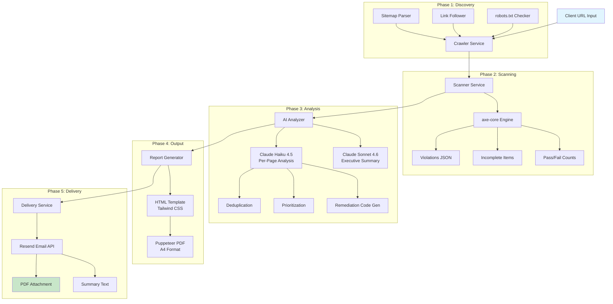

# Technical Architecture: WCAG Accessibility Scan Service

**Version:** 1.0 (MVP)
**Date:** March 15, 2026

---

## System Architecture



---

## Pipeline: URL to Report

```
URL Input
    |
    v
[1. CRAWL] ──── Playwright + Crawlee
    |            - Fetch sitemap.xml (+ sitemap_index.xml recursively)
    |            - BFS link crawl from homepage as fallback
    |            - Block images/fonts/media (40-60% faster)
    |            - Respect robots.txt
    |            - Configurable page cap (25 Starter / 50 Standard / 200 Enterprise)
    |            - Output: List of discovered URLs
    v
[2. SCAN] ───── @axe-core/playwright
    |            - Inject axe-core into each page via Playwright
    |            - Tags: wcag2a, wcag2aa, wcag21a, wcag21aa, wcag22aa, best-practice
    |            - Collect: violations, incomplete, passes, inapplicable
    |            - Output: Per-page violation JSON
    v
[3. ANALYZE] ── Claude API (Haiku 4.5 per-page + Sonnet 4.6 summary)
    |            - Deduplicate violations across pages
    |            - Write plain-English issue descriptions
    |            - Generate code-level remediation examples (before/after)
    |            - Prioritize by user impact (Critical > Serious > Moderate > Minor)
    |            - Produce executive summary + compliance scorecard
    |            - Map violations to WCAG 2.1 criterion numbers
    |            - Output: Structured report JSON
    v
[4. GENERATE] ─ Puppeteer PDF
    |            - Render HTML template with Tailwind CSS
    |            - page.pdf() with printBackground: true, format: A4
    |            - Include: exec summary, scorecard, issue breakdown, priority matrix, remediation guide
    |            - Output: report-{domain}-{date}.pdf (2-8 MB)
    v
[5. DELIVER] ── Resend Email API
                 - Attach PDF (or download link if >10 MB)
                 - Plain-text summary: violation count, critical issues, overall score
                 - Follow-up sequence trigger
```

**End-to-end time for a 20-page site:** approximately 3-5 minutes.

---

## Tools and Dependencies

### Core Stack

```
Node.js 20+
├── crawlee                    # Playwright crawler with queue/dedup/sitemap support
├── @axe-core/playwright       # Official axe-core integration for Playwright
├── playwright                 # Chromium headless browser (JS rendering, SPA support)
├── @anthropic-ai/sdk          # Claude API client
├── puppeteer                  # PDF generation (reuses Playwright's Chromium)
├── resend                     # Email delivery SDK
└── CLI entry point: scan.js   # Manual trigger for MVP
```

### Tool Details

| Component | Technology | License | Cost |
|-----------|-----------|---------|------|
| Crawler | Playwright + Crawlee | Apache 2.0 / MIT | Free |
| Scanner | @axe-core/playwright | MPL 2.0 | Free |
| AI Analysis (per-page) | Claude Haiku 4.5 | Proprietary API | ~$0.008/page |
| AI Analysis (summary) | Claude Sonnet 4.6 | Proprietary API | ~$0.04/summary |
| PDF Generation | Puppeteer | Apache 2.0 | Free |
| Email Delivery | Resend | Proprietary SaaS | Free tier (100K/month) |
| Hosting | Hetzner CX22 VPS | N/A | $5/month |
| SSL | Let's Encrypt | Free | Free |
| Domain | Registrar | N/A | $12/year |

---

## Data Flow

```mermaid
flowchart LR
    subgraph Input
        URL[Client URL]
        EMAIL[Client Email]
    end

    subgraph Crawl
        SITEMAP[sitemap.xml]
        LINKS[Link Discovery]
        URLS[URL Queue<br/>deduplicated]
    end

    subgraph Scan
        AXE[axe-core Engine]
        VIOL[violations[]]
        INCOMP[incomplete[]]
        PASS[passes count]
    end

    subgraph Analyze
        HAIKU[Haiku 4.5<br/>Per-Page]
        SONNET[Sonnet 4.6<br/>Summary]
        DEDUP[Deduplicated<br/>Findings]
        REMED[Remediation<br/>Code Examples]
    end

    subgraph Output
        HTML[HTML Template]
        PDF[PDF Report]
        SEND[Email via Resend]
    end

    URL --> SITEMAP --> URLS
    URL --> LINKS --> URLS
    URLS --> AXE
    AXE --> VIOL
    AXE --> INCOMP
    AXE --> PASS
    VIOL --> HAIKU
    INCOMP --> HAIKU
    HAIKU --> DEDUP
    HAIKU --> REMED
    DEDUP --> SONNET
    REMED --> SONNET
    SONNET --> HTML
    HTML --> PDF
    PDF --> SEND
    EMAIL --> SEND
```

### Data Formats

| Stage | Format | Size Estimate |
|-------|--------|---------------|
| URL list | JSON array | <1 KB |
| axe-core violations (per page) | JSON | ~240 tokens/page avg |
| Claude per-page analysis | Structured JSON | ~800 tokens output/page |
| Claude executive summary | Structured JSON | ~1,500 tokens output |
| Aggregated report data | JSON | ~50 KB for 50-page site |
| HTML report | HTML + inline CSS | ~200 KB |
| PDF report | A4 PDF | 2-8 MB |

---

## Infrastructure Requirements

### MVP (1-10 scans/day)

| Resource | Specification | Cost |
|----------|--------------|------|
| VPS | Hetzner CX22: 2 vCPU, 4 GB RAM, 40 GB NVMe | $5/month |
| Bandwidth | 20 TB included | $0 |
| Storage | 40 GB NVMe (holds ~5,000 PDF reports) | $0 |
| Process model | Sequential scans, single Chromium instance | N/A |

```
CLI script --> Sequential scan --> Single Chromium instance --> Resend delivery
```

### Growth (10-50 scans/day)

| Resource | Specification | Cost |
|----------|--------------|------|
| VPS | Hetzner CX32: 4 vCPU, 8 GB RAM | $10/month |
| Job queue | BullMQ + Redis | $0 (self-hosted) |
| Workers | 2-3 parallel scan workers | Included |
| Storage | S3-compatible (Hetzner Object Storage) | $5/month |

```
Web UI --> Job Queue (BullMQ + Redis) --> Worker pool (2-3 workers)
        --> Each worker: own Chromium --> S3 PDF storage --> Resend
```

### Scale (50-200 scans/day)

| Resource | Specification | Cost |
|----------|--------------|------|
| Orchestration | Docker Compose or Kubernetes | ~$40/month |
| Workers | Auto-scale on queue depth | Variable |
| CDN | PDF download links | ~$5/month |

### RAM Budget (Single Scan)

| Component | RAM Usage |
|-----------|----------|
| Playwright/Chromium | 300-800 MB |
| Puppeteer PDF generation | 200-500 MB |
| Node.js process + axe-core | ~100 MB |
| **Total peak** | **600 MB - 1.4 GB** |
| **Safe concurrent scans at 4 GB** | **2-3** |

---

## Scan Time Estimates

| Site Size | Crawl + Scan | AI Analysis | PDF Gen | Total |
|-----------|-------------|-------------|---------|-------|
| 5 pages | 10-25 sec | 15-30 sec | 10 sec | ~1 min |
| 10 pages | 20-50 sec | 30-60 sec | 10 sec | ~2 min |
| 20 pages | 40-100 sec | 60-120 sec | 15 sec | ~3-5 min |
| 50 pages | 2-4 min | 2-4 min | 15 sec | ~5-9 min |
| 100 pages | 4-8 min | 4-8 min | 20 sec | ~10-17 min |

---

## Claude API Token Budget

### Per Scan (Standard Tier, 50 pages)

| Component | Input Tokens | Output Tokens |
|-----------|-------------|--------------|
| System prompt + instructions | 2,000 | -- |
| axe-core violations JSON | 12,000 | -- |
| Per-page HTML structure summary | 8,000 | -- |
| Remediation report generation | -- | 18,000 |
| Executive summary (Sonnet 4.6) | -- | 1,500 |
| **Total** | **22,000** | **19,500** |

### Cost Per Scan (Claude Haiku 4.5 Batch API)

| Tier | Input Cost | Output Cost | Total |
|------|-----------|------------|-------|
| Starter (5 pages) | $0.002 | $0.006 | **$0.008** |
| Standard (50 pages) | $0.011 | $0.049 | **$0.060** |
| Compliance re-run | $0.004 | $0.017 | **$0.021** |

---

## MVP vs. Full Product Scope

### MVP (Sellable Minimum) -- Build in 10-14 Days

| Feature | Status |
|---------|--------|
| Single URL input, discover up to 50 pages | IN SCOPE |
| axe-core scan against all discovered pages | IN SCOPE |
| Claude analysis: deduplicate, summarize, prioritize | IN SCOPE |
| Professional PDF: exec summary + violations + remediation | IN SCOPE |
| Email delivery via Resend | IN SCOPE |
| CLI trigger: `node scan.js --url <url> --email <email>` | IN SCOPE |
| Disclaimer on every report cover page | IN SCOPE |

### Phase 2 (Month 2-3)

| Feature | Priority |
|---------|----------|
| Web frontend / dashboard | High |
| Stripe payment integration (self-serve) | High |
| Scheduled recurring scans (Compliance tier) | High |
| Delta reports (what changed since last scan) | Medium |
| White-label branding for agency partners | Medium |
| Interactive HTML report version | Medium |

### Phase 3 (Month 4-6)

| Feature | Priority |
|---------|----------|
| Pa11y secondary scanner (+5-8% coverage) | Medium |
| API access for programmatic scanning | Medium |
| Industry benchmark comparisons | Low |
| Real-time scan progress updates | Low |
| Client portal with historical reports | Low |

---

## Estimated Build Timeline

| Component | Time | Dependencies |
|-----------|------|-------------|
| Crawler setup (Playwright + Crawlee) | 1-2 days | Node.js 20+ |
| Scanner integration (axe-core) | 1 day | Crawler complete |
| Claude analysis prompts + aggregation | 2-3 days | Scanner complete |
| Report HTML template (Tailwind CSS) | 2-3 days | Parallel with analysis |
| PDF generation (Puppeteer) | 0.5 days | Template complete |
| Email delivery (Resend) | 0.5 days | PDF generation complete |
| CLI wiring + error handling | 1 day | All components |
| Testing on 3-5 real sites + polish | 2-3 days | Full pipeline |
| **Total** | **10-14 days** | |

---

## Security Considerations

- Scan only publicly-accessible pages (no authentication bypass)
- Respect robots.txt directives
- Never store client credentials
- PDF reports stored encrypted at rest
- API keys managed via environment variables
- Rate-limit scan requests to prevent abuse
- Legal basis: *hiQ Labs v. LinkedIn* (9th Cir. 2022) and *Van Buren v. United States* (SCOTUS 2021) confirm accessing publicly served HTML/CSS/JS is lawful

---

## Error Handling

| Failure Mode | Detection | Recovery |
|-------------|-----------|----------|
| Site unreachable (DNS/timeout) | Playwright navigation error | Retry 2x with 5s backoff, then report as unreachable |
| Anti-bot protection (Cloudflare) | 403/challenge page detected | Flag for manual URL list input |
| axe-core crash on malformed DOM | axe.run() throws | Skip page, note in report as "unable to scan" |
| Claude API rate limit | 429 response | Exponential backoff + retry (max 3 attempts) |
| Claude API timeout | Request timeout | Retry with Batch API fallback |
| PDF generation OOM | Puppeteer crash | Isolate in subprocess, retry with reduced content |
| Resend delivery failure | API error response | Retry 3x, then queue for manual delivery |
